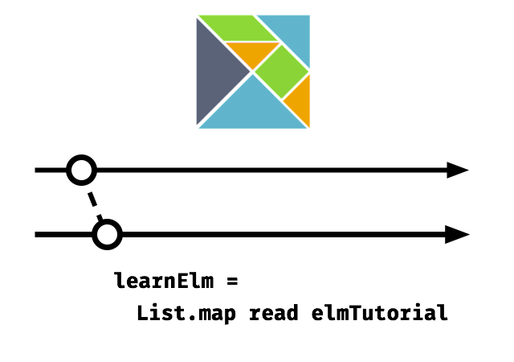

# Elm Tutorial

__Tutorial sobre o desenvolvimento de Single Page Applications (SPAs) com [Elm](http://elm-lang.org/).__

Este tutorial aborda:

- Alguns fundamentos do Elm
- Entendimento de comandos e *subscriptions* em Elm
- Entendimento da arquitetura Elm
- Quebra de um aplicação em sub-componentes e recursos
- Integração de CSS
- Consulta e parsing de JSON
- Roteamento
- Operações CRUD

Leia online [aqui](http://www.elm-tutorial.org/).

Você também baixar a versão offline [aqui (PDF, ePub, Mobi)](https://www.gitbook.com/book/sporto/elm-tutorial/details).

## Código

O código da aplicação de exemplo construída na segunda parte deste tutorial pode ser encontrado em <https://github.com/sporto/elm-tutorial-app>.

## Requisitos

Para este tutorial você irá precisar:

- Elm versão 0.18 (A instalação é coberta mais tarde nesse tutorial)
- Node JS versão 5.1 +
- Gerenciador de pacotes Yarn <https://yarnpkg.com/en/>

## Contribuindo

Por favor, abra issues e envie PRs em <https://github.com/sporto/elm-tutorial>.

---

[Compartilhe no Twitter](https://twitter.com/intent/tweet?&text=Elm%20Tutorial&url=http%3A%2F%2Fwww.elm-tutorial.org&via=sebasporto) | [Siga @sebasporto](https://twitter.com/intent/user?screen_name=sebasporto) | [Siga @marcelgsantos](https://twitter.com/intent/user?screen_name=marcelgsantos)

 This work is licensed under a <a rel="license" href="http://creativecommons.org/licenses/by-nc-sa/4.0/">Creative Commons Attribution-NonCommercial-ShareAlike 4.0 International License</a>.

© Sebastian Porto 2017
